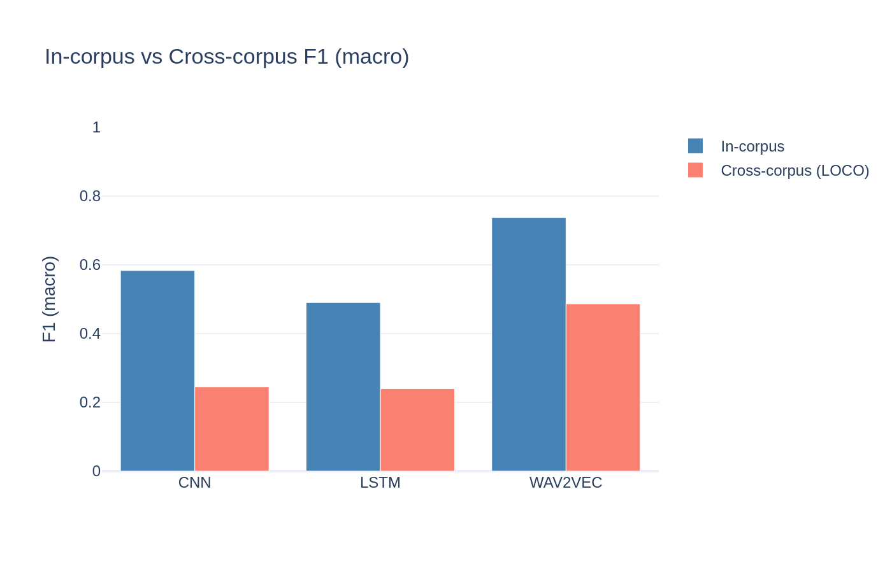
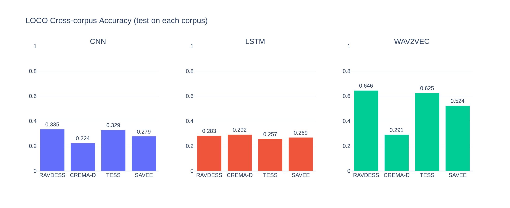
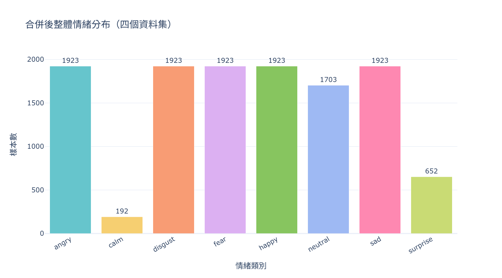
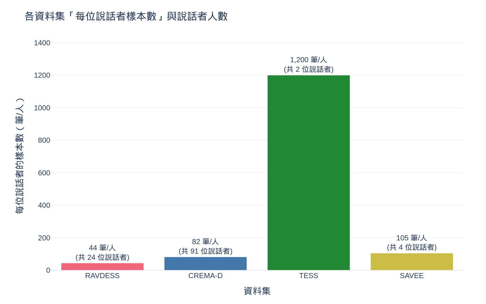

# 語音情緒辨識：特徵表徵與模型架構的跨語料庫遷移能力比較

> Speech Emotion Recognition — A controlled comparison of feature representation vs. model architecture, under speaker-independent and cross-corpus evaluation.


**線上 Demo**：https://huggingface.co/spaces/RaymondChendas/speech-emotion-recognition
　|　**模型**：https://huggingface.co/RaymondChendas/wav2vec2-base-ser

---

## TL;DR

本研究在四個英語語音情緒資料集（11,318 筆、121 位說話者）上，用**控制變因**的方式回答一個問題：**讓辨識變準的關鍵，是特徵表徵，還是模型架構？**

- **特徵 > 模型**：固定 MFCC 特徵時，四個模型（SVM / RF / XGBoost / Bi-LSTM）準確率落在 46.5%–49.4%，差距不到 3%；**換更複雜的模型幾乎沒用**。改變的若是特徵（MFCC → Mel-spectrogram → wav2vec 預訓練），準確率才從 ~49% 一路躍升到 **73.9%**。
- **評估方法決定可信度**：採用**說話者獨立**的 StratifiedGroupKFold（防止聲紋洩漏），並以 **Leave-One-Corpus-Out（LOCO）** 測量對全新錄音環境的泛化。多數公開 SER 結果在這兩點上是寬鬆的。
- **預訓練特徵更耐跨域**：跨語料庫時所有模型都大幅下滑，但 wav2vec 下滑最少（-21.7%，仍有 52.2%），約為 CNN（29.2%）的 1.8 倍。
- **異常會被追查，而不是被接受**：wav2vec 在 CREMA-D 跨語料庫僅 29.1%，本研究診斷出原因（訓練資料量縮減 + domain shift），而非歸因於 overfitting。

---

## 研究問題與動機

在 SER 文獻中，研究者通常**同時**更換特徵與模型，因此難以判斷準確率的提升究竟來自何者。這讓「要改善系統該優先投入在哪裡」這個實務問題缺乏明確答案。

本研究的做法是**隔離變因**：在**相同資料、相同評估框架**下，只改變「特徵」與「模型」，系統性比較三種特徵表徵 × 六種分類方法，直接量化兩者各自的貢獻。

---

## 評估設計：本研究的方法論核心

準確率數字本身不難看，難的是讓它**可信**。本研究刻意在兩個常被忽略的地方加嚴。

### ① 說話者獨立——StratifiedGroupKFold

若同一位說話者的錄音同時出現在訓練集與測試集，模型可以靠「認得這個人的聲音」猜對情緒，而非真正學到情緒特徵——分數會虛高且不可信。

本研究使用 `StratifiedGroupKFold（K=5, group=speaker_id, stratify=emotion）`，確保**同一說話者的所有錄音只出現在同一個 fold**，測試時面對的都是模型沒聽過的人。這是衡量真實泛化的前提。

### ② 跨語料庫泛化——Leave-One-Corpus-Out (LOCO)

說話者獨立仍無法回答「換到完全不同的錄音環境還能用嗎」。LOCO 以三個資料集訓練、第四個**完全沒見過**的資料集測試，四組輪流取平均，模擬系統真實部署時面對的陌生人與陌生環境。

> In-corpus 是基準線；LOCO 才是模型能否落地的真正考驗。

---

## 主要結果

### In-corpus（說話者獨立 5-fold 交叉驗證）

| 模型 | 特徵類型 | 準確率 | F1 Macro |
|------|----------|--------|----------|
| SVM | MFCC 統計特徵 | 49.2% | 48.9% |
| Random Forest | MFCC 統計特徵 | 46.5% | 45.3% |
| XGBoost | MFCC 統計特徵 | 48.7% | 48.1% |
| Bi-LSTM + Attention | MFCC 時序 | 49.4% | 49.1% |
| CNN | Mel-spectrogram | 58.6% | 58.3% |
| **wav2vec 2.0** | **預訓練 embedding** | **73.9%** | **73.8%** |

*6 類情緒，隨機猜測基準 16.7%。MFCC 下四個模型差距僅 2.9%；換特徵才帶來大幅躍升。*

### In-corpus vs 跨語料庫（LOCO）



| 模型 | RAVDESS | CREMA-D | TESS | SAVEE | **平均** |
|------|---------|---------|------|-------|---------|
| CNN | 33.5% | 22.4% | 32.9% | 27.9% | 29.2% |
| Bi-LSTM | 28.3% | 29.2% | 25.7% | 26.9% | 27.5% |
| **wav2vec 2.0** | **64.6%** | **29.1%** | **62.5%** | **52.4%** | **52.2%** |



所有模型跨語料庫都顯著下滑（CNN 58.6% → 29.2%，**-29.4%**；wav2vec 73.9% → 52.2%，**-21.7%**）。wav2vec 下滑幅度最小，顯示大規模預訓練帶來的通用語音表徵具備較強的跨域遷移能力——這正是本研究核心問題的答案。

---

## 進一步分析：CREMA-D 跨語料庫為何特別低？

wav2vec 在 CREMA-D 上只有 29.1%，與其他語料庫落差明顯。比起直接歸因於 overfitting，本研究比較各語料庫的下滑幅度後，找到兩個結構性原因：

| 測試語料庫 | In-corpus → LOCO | 下滑 |
|-----------|------------------|------|
| RAVDESS | 73.9% → 64.6% | -9 |
| TESS | 73.9% → 62.5% | -11 |
| SAVEE | 73.9% → 52.4% | -22 |
| **CREMA-D** | **73.9% → 29.1%** | **-45** |

1. **訓練資料量縮減**：CREMA-D 佔全部資料 66%，當它作為測試集時，訓練資料從 11,318 筆驟降至 3,876 筆（剩 34%）。
2. **domain shift 最大**：CREMA-D 為演員在錄音棚念單一句子，錄音風格與其他三個資料集差異最大。

**結論：這是資料分布問題，不是模型過擬合。** 此區別會直接影響後續的模型設計決策。

---

## 資料與前處理

四個公開英語語音情緒資料集，統一取自 Kaggle（[Shivam Burnwal 彙整版](https://www.kaggle.com/code/shivamburnwal/speech-emotion-recognition)）：

| 資料集 | 原始機構 | 筆數 | 說話者 |
|--------|----------|------|--------|
| RAVDESS | 加拿大 Ryerson 大學 | 1,056 | 24 |
| CREMA-D | 美國演員資料庫 | 7,442 | 91 |
| TESS | 多倫多大學 | 2,400 | 2 |
| SAVEE | 英國薩里大學 | 420 | 4 |
| **合計** | | **11,318** | **121** |

**情緒標籤統一化**：移除 calm 與 surprise（樣本數偏少、且非各資料集都有），保留六類：angry、disgust、fear、happy、neutral、sad。下圖可見保留的 6 類分布均衡，而被移除的兩類明顯偏少：



資料的**不平衡與多樣性**正是跨語料庫研究的前提。一個值得注意的極端案例：TESS 僅 2 位說話者，每人卻貢獻約 1,200 筆；相對地 CREMA-D 有 91 位說話者、每人僅約 82 筆。這種「少數說話者、大量樣本」的結構（TESS 佔全資料約 21%），使說話者獨立的分組必須特別審慎。



**前處理**：所有音訊統一重採樣至 16 kHz、轉單聲道、峰值正規化至 [-1, 1]。此階段刻意**不**做截斷／補零以保持可逆，截斷與補零延後至特徵萃取時依模型需求執行。

---

## 方法論細節

### 三種特徵 × 六種方法

| 特徵 | 維度 | 對應模型 |
|------|------|----------|
| MFCC 統計特徵 | 234D（mean/std/max/min/skew/kurt）| SVM / Random Forest / XGBoost |
| MFCC 時序 | (94, 39) | Bi-LSTM + Attention |
| Mel-spectrogram | (128, 94) | CNN（4 卷積塊）|
| 原始波形 → wav2vec 2.0 | 48,000 取樣點（3 秒 @ 16 kHz）| Fine-tuning |

控制變因的精神：**相同的 11,318 筆資料 × 相同的 StratifiedGroupKFold × 唯一改變的是特徵與模型。**

### 模型架構

- **傳統 ML**：SVM（RBF, C=1.0）、Random Forest（n=100）、XGBoost（n=200, lr=0.1），輸入皆為 234D MFCC 統計特徵。
- **CNN**：4 個卷積塊（32→64→128→256）+ Global Average Pooling + 2 層分類器。
- **Bi-LSTM**：2 層雙向 LSTM（hidden=128）+ Bahdanau Self-Attention + 2 層分類器。
- **wav2vec 2.0**：`facebook/wav2vec2-base`（95M 參數）+ Projection Head + Softmax，端到端 fine-tuning。

---

## 可重現性與專案結構

工程上刻意將**批次處理**與**互動驗證**分離：耗時的批次工作抽成可獨立執行、可中斷續跑的腳本；notebook 只負責驗證與視覺化。

```
SER_project/
├── data/metadata.csv          # 主索引（11,318 筆，含特徵路徑）
├── src/                       # 批次處理腳本（CPU）
│   ├── audio_utils.py / data_utils.py / feature_utils.py / models.py
│   ├── run_preprocessing.py       # 重採樣／正規化
│   ├── run_feature_extraction.py  # MFCC / Mel-spectrogram
│   ├── run_baseline_ml.py         # SVM / RF / XGBoost 訓練
│   └── run_extract_embeddings.py  # DL 嵌入向量萃取
├── notebooks/                 # 驗證、視覺化、與 GPU 訓練
│   ├── 01_eda → 04_baseline_ml      # 分析與傳統 ML
│   ├── 05_train_cnn → 07_train_wav2vec  # DL 訓練（Colab GPU）
│   ├── 08_cross_corpus_eval         # LOCO 評估
│   └── 09_embedding_analysis / 10_results_summary
├── results/                   # 各模型結果 JSON + figures/
├── demo/                      # 本地 Gradio Demo + 保險樣本
└── hf_space/                  # Hugging Face Spaces 部署檔
```

> **分工說明**：深度學習訓練（CNN / Bi-LSTM / wav2vec）需要 GPU，在 Google Colab 的 notebook 上進行；其餘批次處理（前處理、特徵萃取、傳統 ML 訓練、embedding 萃取）在本地以 `src/run_*.py` 腳本執行。

### 環境

```bash
python -m venv venv
venv\Scripts\activate        # Windows
pip install -r requirements.txt
pip install torch torchaudio --index-url https://download.pytorch.org/whl/cpu
```

---

## 即時 Demo

最快的方式是直接開啟線上版（免安裝）：

**▶ https://huggingface.co/spaces/RaymondChendas/speech-emotion-recognition**

支援上傳音訊或即時麥克風錄音，輸出情緒類別、各類信心分數、機率分布圖與 Mel-spectrogram。背後為 fine-tuned wav2vec 2.0（已公開於 [HF Hub](https://huggingface.co/RaymondChendas/wav2vec2-base-ser)）。

本地執行：

```bash
cd demo && python app.py     # 開啟 http://127.0.0.1:7860
```

---

## 限制與未來方向

**限制**
1. **英語資料集**：四個資料集均為英語，結論不可直接推論至中文或其他語言。
2. **參數量不對等**：wav2vec（95M）遠大於 CNN（~1M）；本研究比較的是「特徵表徵方式」，而非「相同計算量下的效率」。
3. **Embedding 視覺化的方法論限制**：NB09 的 embedding 視覺化採用 fold-1 checkpoint 對全資料萃取，約 80% 為訓練資料，cluster 品質可能被高估，主要用於模型間的相對比較。

**未來方向**
1. **Knowledge Distillation**：將 wav2vec 知識蒸餾至輕量模型，降低部署成本。
2. **多語言擴展**：引入中文語音情緒資料集，測試跨語言遷移能力。
3. **Out-of-fold Embedding**：以嚴格 OOF prediction 生成 embedding，消除 fold-1 方法論限制。

---

## 技術棧

| 類別 | 工具 |
|------|------|
| 深度學習 | PyTorch、HuggingFace Transformers |
| 音訊處理 | librosa、soundfile、audiomentations |
| 傳統 ML | scikit-learn、XGBoost |
| 視覺化 | Plotly |
| Demo / 部署 | Gradio、HuggingFace Spaces |

## 資料來源與授權

本專案程式碼以 MIT 授權釋出。原始音訊資料版權屬各資料集原始機構；保險樣本取自 TESS（CC BY-NC 4.0），僅供非商業展示。因版權與檔案大小，原始音訊與部分中間檔不隨 repo 提供，可依 notebook 流程重建。

## 關於

東吳大學「深度學習創新與應用」課程期末專題。
